# Configuring WebCenter Content Custom Meta Data and Profile and Rules

## Introduction

This lab will guide you through the process of creating Custom Metadata,Profile,Profile Rule , Workflow(Criteria ) and User , Groups and role assignment for WebCenter Content Server.

**Estimated Lab Time**: *40 minutes*

### Objectives

- Download and install Oracle WebCenter Content Administration Desktop Client.
- Create Custom Metadata.
- Create a Profile.
- Create a Profile Rule.
- Create a Workflow(Criteria).
- User , Groups and Role Assignment.

### Prerequisites

This lab assumes you have:

- Access to WCC Marketplace Environment

This lab assumes you have completed:

- Lab: Initialize WCC Environment
- Lab: Create Users and Groups
- Lab: Create Security Groups, Roles, Aliases and Accounts

## Task 1: Configure Oracle WebCenter Content Administration Desktop Client

To Configure WebCenter Content Administration Desktop Client, follow the below steps;

1. Launch WebCenter Content Administration Desktop Client.

<if type="Windows">

- In Windows Start menu search **Oracle WebCenter Content Administration**
- Click on **Oracle WebCenter Content Administration** app
 
</if>

<if type="MAC">

- In Mac **Spotlight search** search **Oracle WebCenter Content Administration**
- Click on **Oracle WebCenter Content Administration** app
 
</if>

2. Enter the **User Name, Password, Server**. Click **OK**.
   - **User Name**: Enter
         ```
         <copy>weblogic</copy>
         ```
   - **Password**: Enter
         ```
        <copy>Welcome1</copy>
         ```
   - **Server**: Enter
         ```
         <copy>https://localhost:16200/cs/</copy>
         ```
    > Note : Replace `"https://localhost"` with your **hosturl** ( eg: `"http://wcc-document-livelab.livelabs.oraclevcn.com"` or `"https://192.0.0.0"`)


3. If **Warning** dialog is opened due to insecure certificate, press **Yes** to continue.
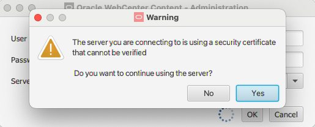
4. Wait for WebCenter Content Administration Dialog to open
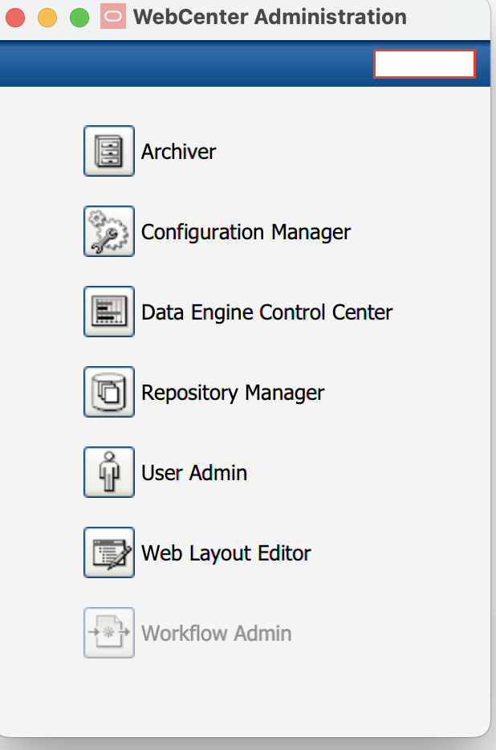

## Task 2: Create a Custom Metadata

- To create Custom Metadata (Employee ID, Full Name,Policy Name etc) in WCC follow these steps:

1. Login to WebCenter Content Administration Desktop Client as user with Administrator Privilege.
2. Click on Configuration Manager Link
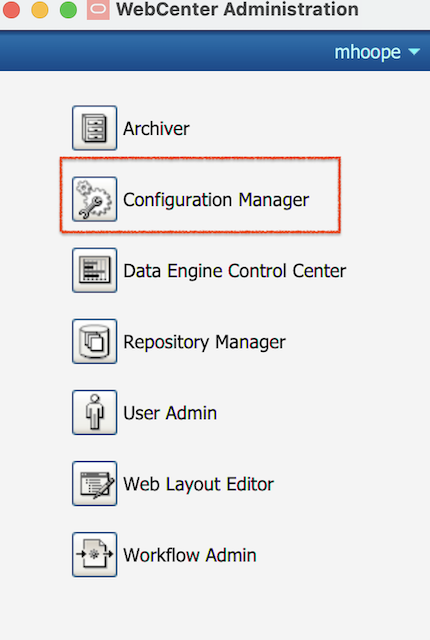
3. Click  **Information Fields - Add** button Configuration Manager Menu .
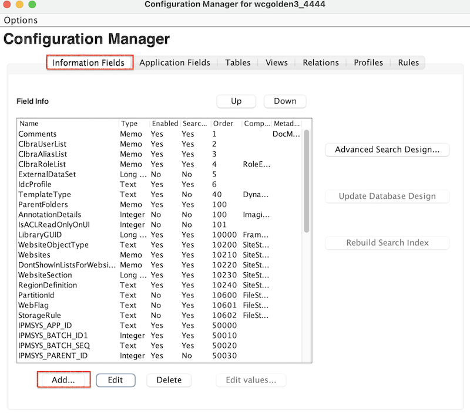
4. Enter field name as CustomerID then click Ok.
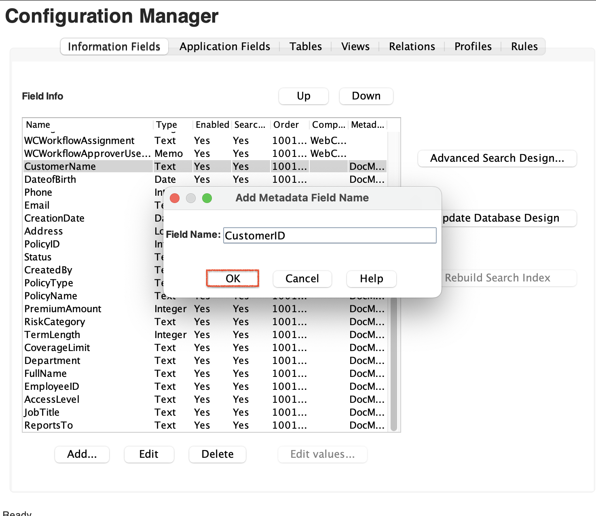
5. In Add CustomerId MetaData Field fill following details.

- Field Caption - Name of the Field.
- Select Text as Field Type - Type of the Field.
- Meta Data Set - By default select Meta Data Set as DocMetadata.
- Give default value if required.
- Click check box Enable on User Interface.
- Click check box Enable for Search Index if required.
- Finally click ok to Create CustomerId meta data.
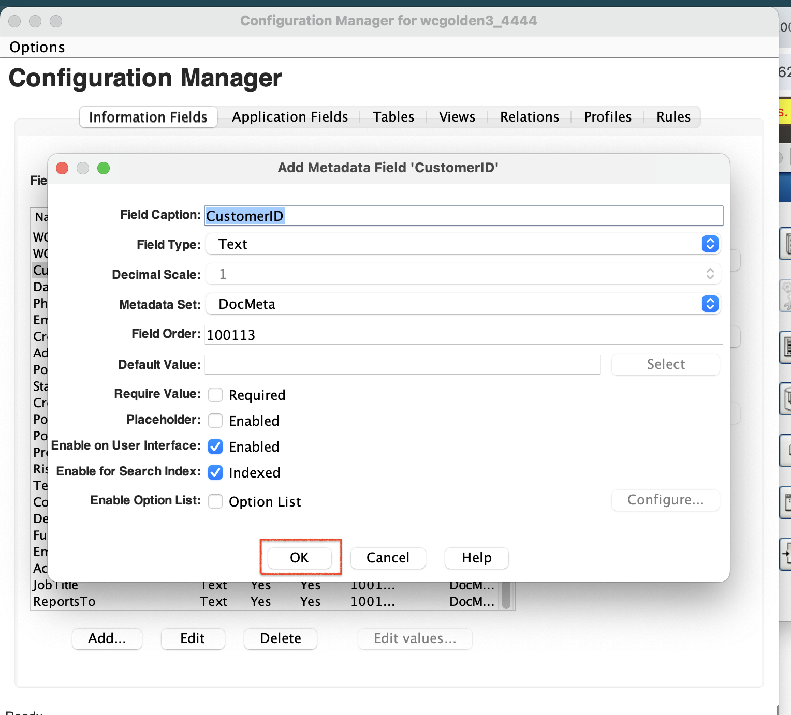

1. **Similarly to Add PolicyType MetaData Field as Dropdown (Option List), follow these steps:**

   - Repeat the last step to add Custom metadata.
   - **Field Caption** – Name of the Field.
   - **Select Text as Field Type** – Type of the Field.
   - **Meta Data Set** – By default, select Meta Data Set as DocMeta.
   - **Give default value** if required.
   - Click **Enable on User Interface** checkbox.
   - Click **Enable for Search Index** checkbox if required.
   - **To create LOV Values:**
     1. Click **Enable Option List** checkbox.
     2. After enabling the Option List checkbox, click **Configure** button.
   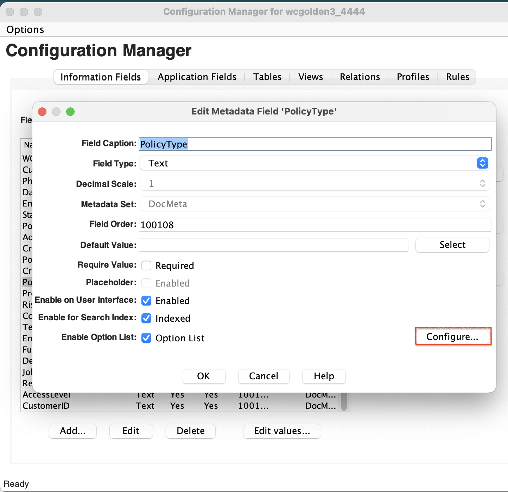
   - **Configure Option List:**
     - Once Option list edit config menu opens pleas follow these steps
     - Select **Select List Validated** in Option List Type LOV list.
     - Click **Use option list** checkbox and type the name of the LOV.
     - Click **Edit Button**.
        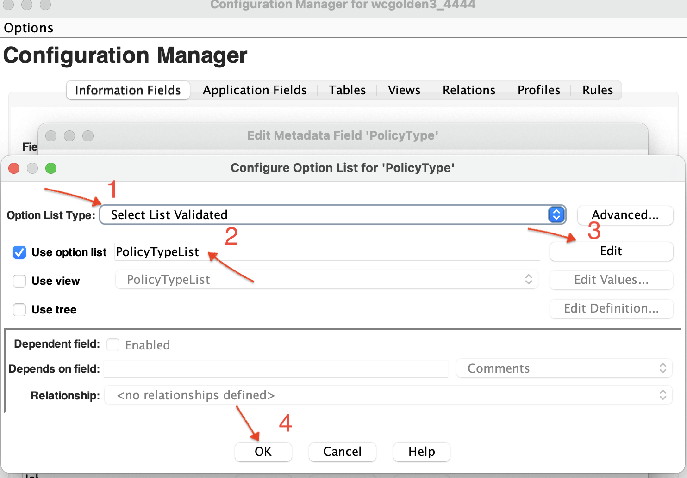

     - Select Select List Validated in Option List Type LOV list
     - Click Use option list check box and type the name of the LOV.
     - Click Edit Button
     - Enter the required options, such as 'Life Insurance,' then press Enter.
     - Repeat this for each additional value
     - Once all values are entered, press Enter again to finish.
     - Click OK to Create Policy Type LOV .

        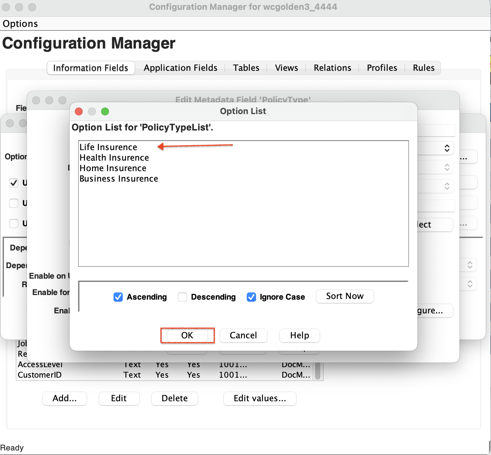

1. **Similarly to Add  Creation Date Date field follow these steps:**

- Repeat the last step to add Custom metadata.
- Enter Fields Name as CreationDate Then Click Ok.
- Field Caption - Name of the Field
- Select Date as Field Type - Type of the Field
- Meta Data Set - By default select Meta Data Set as DocMeta
- Give default value if required.
- Click check box Enable on User Interface.
- Click check box Enable for Search Index if required.
- Finally click ok to Create CreationDate meta data

    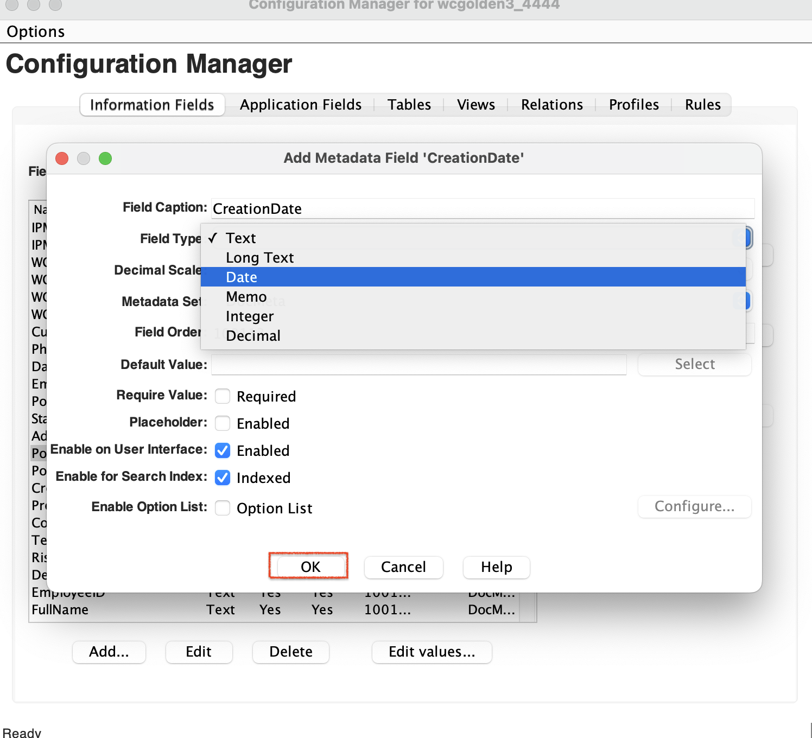

1. **Similarly  create following Metadata.**

- **Customer Profile MetaData**
Metadata Field | Definition | Field Type
--- | --- | ---
Customer ID | Unique identifier for each customer. | Text
Customer Name | Full name of the policyholder. | Text
Date of Birth | Customer’s birth date for policy verification. | Date
Phone | Customer’s registered contact number. | Integer
Email | Email address for communication. | Text
Address | Residential or official address of the customer. | Text
Policy ID | Unique identifier for an insurance policy. | Integer
Status| Current status of the customer’s policy (Active, Inactive, Lapsed). | Text
Creation Date | Creation date | Date
Created By | User who created the Customer  | Date

- **Insurance Type Metadata**
Metadata Field | Definition | Field Type
--- | --- | ---
Customer ID | Unique identifier for each customer. | Text
Policy Name | Name of the insurance policy (e.g., Life Insurance, Auto Insurance). | Text
Policy Type | Enum values: Life, Auto, Home, Health, Business. | Text (Enable Option List)
Premium Amount | The cost of the insurance policy. | Integer
Coverage Limit | Maximum coverage provided by the policy. | Integer
Term Length | Duration of the policy (e.g., 10 years, 20 years). | Integer
Risk Category | Classification of risk based on customer profile.| Text (Enable Option List)
Creation Date | Creation date | Date
Created By | User who created the Customer  | Date

- **HR Department Metadata**
Metadata Field | Definition | Field Type
--- | --- | ---
Customer ID | Unique identifier for each customer. | Text
Policy Name | Name of the insurance policy (e.g., Life Insurance, Auto Insurance). | Text
Policy Type | Enum values: Life, Auto, Home, Health, Business. | Text (Enable Option List)
Premium Amount | The cost of the insurance policy. | Integer
Coverage Limit | Maximum coverage provided by the policy. | Integer
Term Length | Duration of the policy (e.g., 10 years, 20 years). | Integer
Risk Category | Classification of risk based on customer profile.| Text (Enable Option List)
Creation Date | Creation date | Date
Created By | User who created the Customer  | Date

- This Completes Creating Custom Metadata Fields.

## Task 3: Create a Profile Rules

A profile consists of one or more rules and a trigger value. The rules determine how metadata fields are displayed on the Check In, Update, Content Information, and Search pages and if a rule is used (depending on how it is evaluated). Each rule consists of the following:

- A set of metadata fields.
- An optional activation condition.
- An option that indicates if it is a global rule and has a specified priority.
- An option that indicates if the metadata fields in the rule are grouped and if an optional header is used.

1. **To create a Profile Rules (CustomerProfileMetaDataRules,InsurenceTypeMetaDataRules,HRDepartmentMetadataRules) in WCC follow these steps**

- Login to WebCenter Content Administration Desktop Client as user with Administrator Privilege.
- Click on Configuration Manager Link
    
- Click  Configuration Manger > Rules  button in Configuration Manager Menu.
    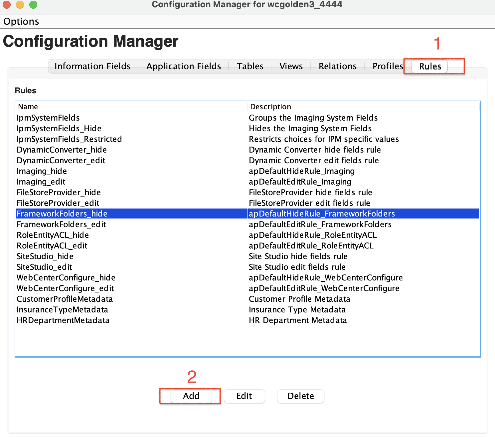
- Enter the Name for the Rule.
- Enter the Description for the Rule.
- Select Is group check box this will make this group meta data headder to appear in the form while creating document using this Profile Rule
- Select Has group header check box
- An activation condition allows a change in the profile behavior based on different inputs. For example, a rule is not active for the search page or for a contributor, or certain fields are hidden or overridden on check in. Also, because profiles are activated during any check-in process, distinctions are made between a browser check in and a batch-load check in.
 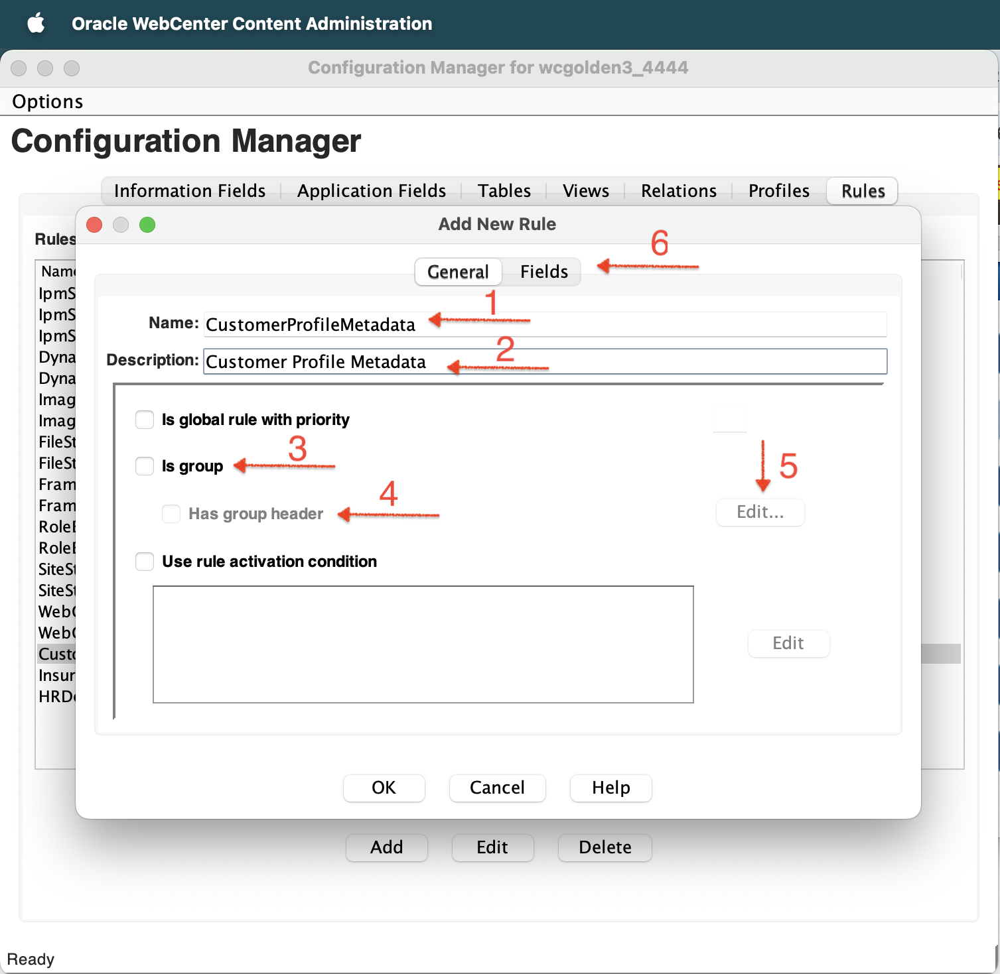
  - You can base an activation condition for a rule on:
    - A system event: These include on-request events, on-submit events, and on-import events.
    - A user action: These include check in new, check in selected, content information, content update, and search.
    - A workflow state: These are contingent on if the content item is in a workflow.
    - A document type: These can use components based on document metadata fields.
    - A user type: These can use components based on user metadata fields.
- Click Edit button to give name of headder.
  - Enter the header name in text box then click ok.

 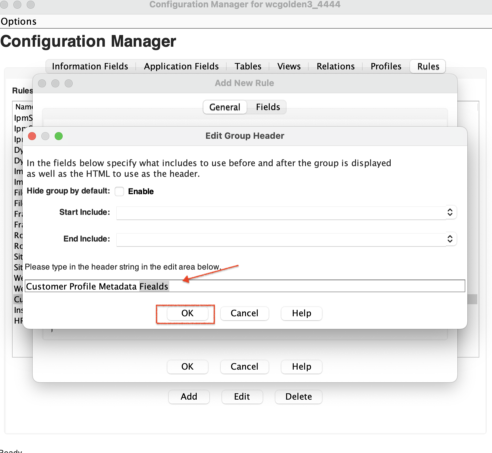

- Click Fields add MetaData.
  - Once the Edit Rule config screen open click Add button.
  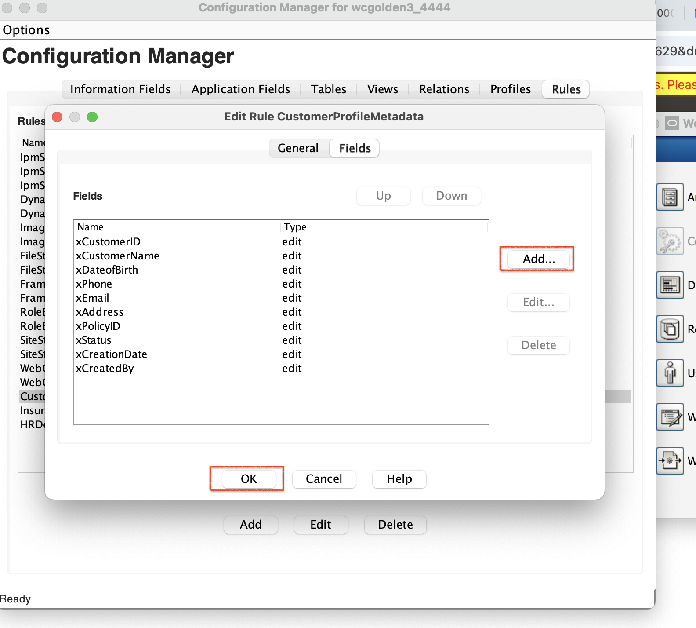
- Click Display Information fields check box to show custom meta data select.
- Select Field Name to add part of Rule.
- Field position (required): Adjusts the general placement order of the metadata field. Values are top, middle, and bottom.
- Once you select the both the values click ok.
  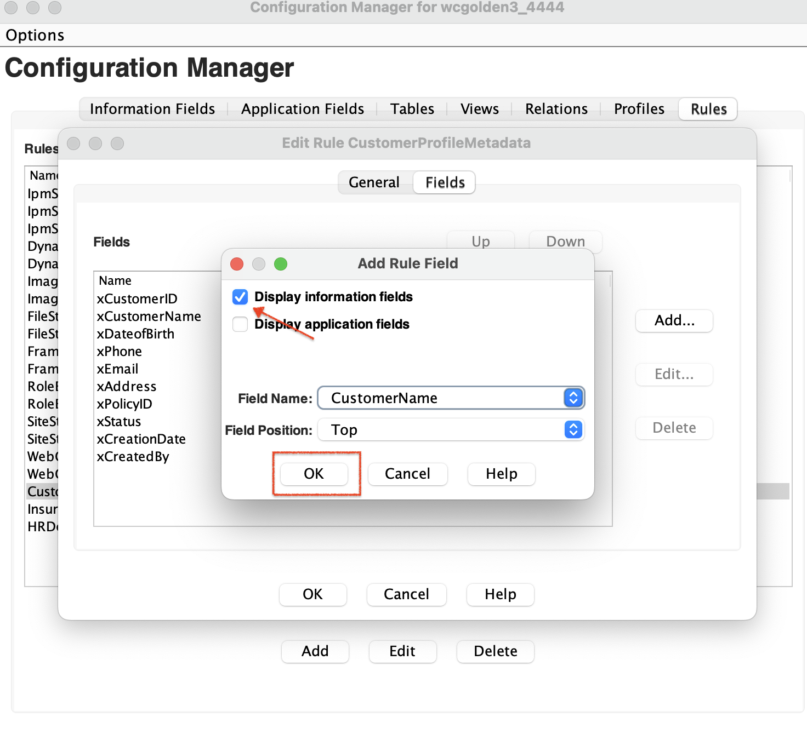
- Once you click ok there will other menu will open here you can customise meta data details
- Display type (required): Determines how the metadata field is displayed on the Check In and Search pages.Values can be Edit, Info Only, Hidden, Excluded, or Required. If required, a message is also required.
- Click Use custom label check box the enter the field labale this allow to customise the metadata label values .
- You can choose to select Exclude field from the group count checkbox this will exclude field count in the API Response
- Use Default value (optional): Displays a default value for the metadata field.
- Is Derived value (optional): Enables the metadata field to be set to a specified value on update or check in.
- Has Restricted list (optional): Allows the list metadata field to be restricted to either a specific list of values or to a filtered list of values.
- Once you enter the all the information click ok to add metadata to Profile Rule.
  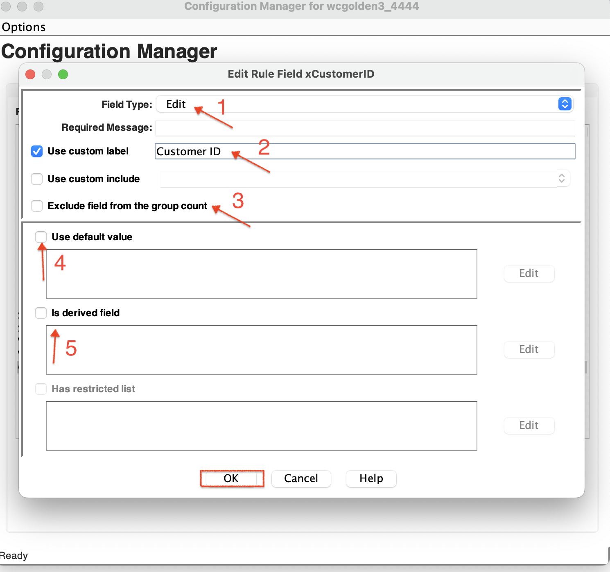
- Similarly Add all other metadata according the Customer Profile MetaData.
- Create Similer Rule for Insurence Type MetaData and HR Department Metadata and Add the assoicated meta data to the rule.

## Task 4: Create a Profile

Administrators can use content profiles to selectively include or reorder metadata fields to produce targeted Check In, Update, Content Information, and Search pages. Content profiles do not create or modify any Oracle WebCenter Content Server tables.They are simply used as a type of filter for what information is displayed.

After you create a content profile, it is always active. You can disable the link on the user interface, but the profile rules remain functional unless the profile is deleted.
A profile is composed of rules and a trigger value, which are set up on the Profiles and Rules tabs of the Configuration Manager page.
Administrators can create multiple content profiles and all are available to the end user. For each profile, the end user has a distinct check-in page and search page available. Although all profiles are visible to all users, each user can configure their user interface to hide or display links to specified profiles.

Content profiles are composed of the following:

- Rules: A rule consists of a set of metadata fields that determine if fields are editable, required, hidden, excluded, or read-only based on their criteria when specific conditions are met. You can change a rule's behavior based on an input, or activation condition. You can evaluate a rule for every profile (global), or you can evaluate the rule for specific profiles. For ease of use, you can use rules to group metadata fields under an optional header.
    For example, a profile's rules can determine the user type and, depending on the document type being checked in, ensure that only specific metadata fields are displayed. Rules must be established before a profile is created.
- Triggers: A trigger field is a metadata field that is defined on the Configuration Manager: Profiles tab. If a document matches a trigger value for a profile, then that profile is evaluated for the document. There can be an unlimited number of profiles, but only one trigger value per profile.

Although you create rules before you create triggers and profiles, it is necessary to know what your trigger is before creating rules.

To create a new profile:

- Login to WebCenter Content Administration Desktop Client as user with Administrator Privilege.
- Click on Configuration Manager Link
    
- Click  Configuration Manger > Profile button in Configuration Manager Menu.
    
- Click Trigger drop downs field and select Customer value in option list, click ok.
    
- Click Add button.
- Enter the name of the new profile and click OK.
 
- Enter the name of the new profile and click OK.
  - On the Add/Edit Profile page, enter the following information:
    - Display label: Specify how the profile is listed in menus.
    - Description: brief description of the profile.
    - Trigger list: the list values associated with the trigger.
    - Exclude non-rule fields: Select to exclude all metadata fields that do not belong to the rules included in the profile.
    - Restrict personalization: Select to suppress check in or search links to a particular user or group of users. Idoc Script code based on user information is entered into the Profile Links page and must evaluate to true before a link is displayed. If deselected (default), all links are displayed for all users by default unless evaluated by another profile. Click Edit to customize the list of users.
    
- Click Add to include rules in the new profile.

  - **Note:-**
    - You cannot add rules to the profile until you create and define them using the Configuration Manager: Rules tab.
    - On the Add Rule in Profile page, select rules from the list and assign them a general placement priority value.
    - Adjust the placement order of the rules in the list by pressing the Up or Down button. The position of each rule in the list is relevant to its priority in the evaluation process. The general position (top, middle, or bottom) in the list is established when the rule is initially added to the profile. The buttons further refine the placement by moving the rule to a more precise position.
    - Click OK.
    - The new profile is included in the Profiles list on the Profiles tab.

## Task 5: Restricting Profile Values in Search and Check in

- When a profile is enabled on the Edit Content Profile Links page, the profile is available from the Search and New Check In menus on the toolbar.
- If no profiles are enabled for display, the Search and New Check In menus become direct links to the Advanced Search page and standard Content Check In Form, respectively.
- After a profile has been created, it appears in the Search and New Check In menus on the toolbar after refreshing the browser session.
- By default, all profiles are listed as options under both menus. However, not every user is authorized to use all of the listed profiles.
- On the Edit Content Profile Links page, select or clear applicable check boxes to specify the profiles to display.
    
- Click Restricted personalization links check box as Enabled .
- Click Edit button .
  
- Click Has Script for the check-in link check box and Click Edit Button.
  
- Click Add button in Condition box.
  
- Enter the name for the condition.
 
- Choose appropriate condition to hide the link then click add.
- The selected condition will be added to Clauses. then Click ok.

## Task 6: Creating a Workflows

- A workflow specifies how to route content for review and approval before it is released to the system.
- The workflow notifies users by e-mail when they have a file to review. For information about workflow types and uses
- Designing an effective workflow is an iterative process. After initial planning, workflows are refined as the process is implemented.
- Good planning in the beginning can reduce the amount of rework.
- This Completes this Live Lab.

There are three types of workflows:

- A basic workflow defines the review process for specific content items, and must be initiated manually.
- A criteria workflow is used for content that enters a workflow automatically based on metadata that matches predefined criteria.
- A sub-workflow is initiated from a step in another workflow and is created in the same manner as criteria workflows. Sub-workflows are useful for splitting large, complex workflows into manageable pieces.

Steps define the process and the functionality of the workflow. Each workflow can include multiple review and notification steps with multiple reviewers to approve or reject the content at each step. For each step in a workflow, a set of users and a step type are defined.

The users defined for a step can perform only the tasks allowed for that step type.

Step Type | Description
--- | ---
Contribution | The initial step of a Basic workflow. Administrators define the contributors when the workflow is created.
Auto-Contribution | The initial step of a Criteria workflow. There are no predefined users involved in this step. The contributor who checks in a content item that enters the workflow process automatically becomes part of the workflow.
Review| Users can approve or reject the content; editing is not allowed. You can also specify that the user must approve and sign the content with an electronic signature.
Review/New Revision | Users can edit the content if necessary then approve or reject it, creating a new revision.
Review/Edit Revision | Users can edit the content if necessary then approve or reject it, maintaining the revision.

After a workflow is enabled, it goes through several specific stages:

- When a content item is approved by the minimum number of reviewers for a particular step, it goes to the next step in the workflow. If the step is defined with 0 approvals required, the reviewers are notified, but the content goes to the next step automatically.
- If any reviewer rejects the content, it goes back to the most recent Review/Edit Revision or Review/New Revision step. If there is no such step, the content goes back to the original author.
- Depending on how the edit criteria is defined, the most recent Review/Edit Revision or Review/New Revision step can result in a new revision or an updated revision.
- A revision can be released:

- **To create Workflow in WCC follow these steps:**
- Login to WebCenter Content Administration Desktop Client as user with Administrator Privilege.
- Click on WorkflowAdmin
 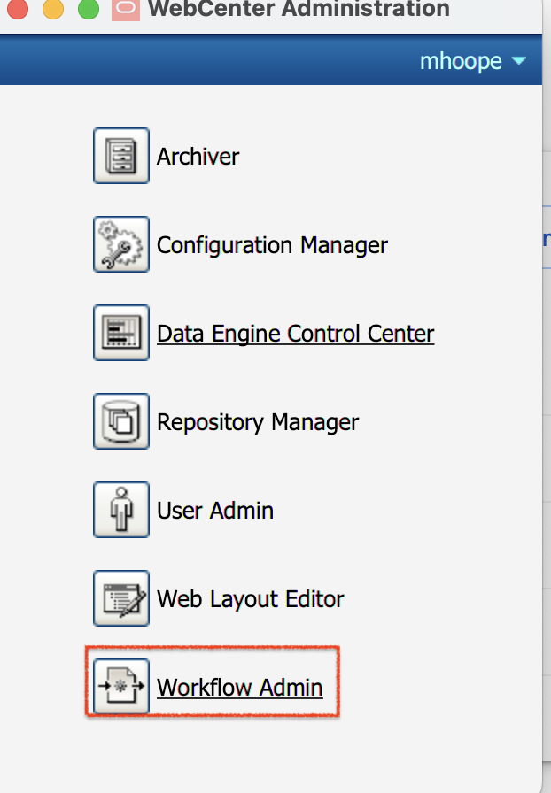
- Click the Criteria tab.
- On the New/Edit Criteria Workflow page, enter a name in the Workflow Name field. Maximum length is 30 characters. Special characters (; @&, and so on) are not allowed. You cannot change the workflow name after the workflow is created.
- Enter a detailed description for the workflow in the Description field.
- Select the Security Group from the list.
 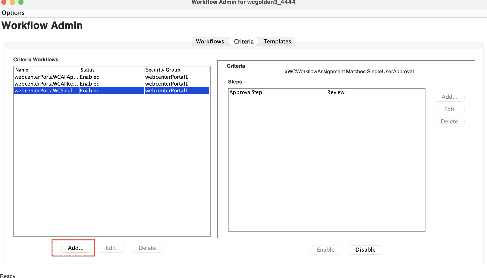
- Select an option from Original Author Edit Rule to specify if the original author can edit the revision or create a new revision if the item is rejected.
- To use a workflow template, select the Use Template check box and select the template name. This box is displayed only if a template currently exists. For more information, see Workflow and Script Templates.
- To create a Criteria workflow, select the Has Criteria Definition check box. To create a sub-workflow, deselect the check box.
- For a Criteria workflow, define the criteria by choosing the appropriate Field, Operator, and Value. Field values include Content ID, Author, Type, Account and any custom metadata of type Text or Long Text.
- Click OK.
- If a template was not used to create steps or to add another step, click Add in the right pane of the Workflow Admin page.
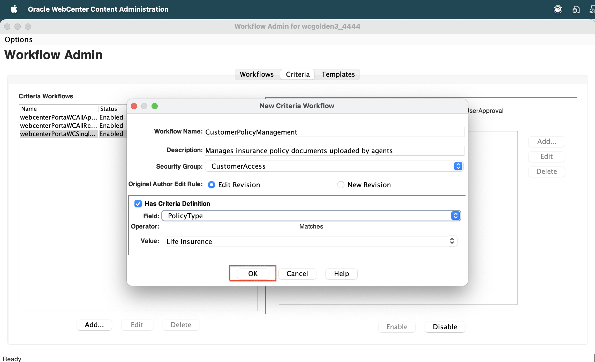
- On the Add New/Edit Step page, enter an appropriate Name for the step. You cannot change the name after the step is created. The name is usually descriptive of the step (for example, EditorialReview or TechnicalReview).
- To require that a reviewer provide credentials for an electronic signature, select Requires signature on approval. This option is available only if the Electronic Signatures component is enabled.
- An electronic signature uniquely identifies the contents of the file at a particular revision and associates the signature with a particular reviewer. If selected, the standard Approve action is replaced by the Sign and Approve action in the list of step options provided to the reviewer.
- Enter a Description for the step.
  - Specify the authority level of the users for the step:
    - Users can review the current revision: Users can approve or reject the revision but cannot edit the revision.
    - Users can review and edit (replace) the current revision: Users can edit the revision, approve it, or reject it. An edit does not update the revision.
    - Users can review the current revision or create a new revision: Users can edit the revision, approve it, or reject it. An edit updates the revision. This option preserves the original content and provides an audit trail of changes.
 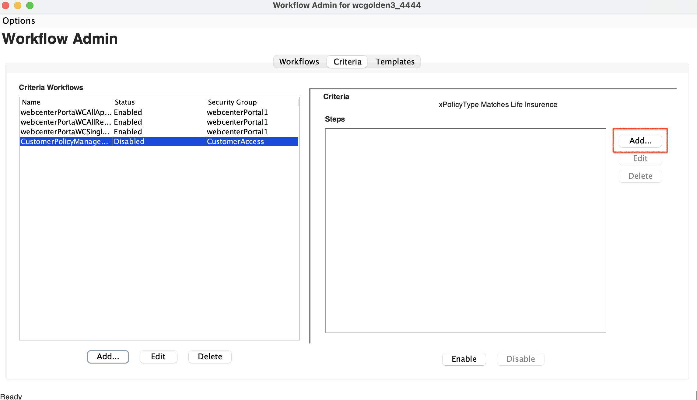
  - Select the type of users to be added to the step. Multiple types can be defined:
    - To add a group of users defined by an alias, click Add Alias. On the Add Alias to Step page, choose the alias from the displayed list.
    - To add individual user logins, click Add User. On the Add User to Step page:
    - To narrow the list of users, select the Use Filter check box, click Define Filter, select the filter criteria, and click OK.
    - To select a range of users, click the first user, then press and hold Shift and click the last user in the range.
    - To select users individually, press and hold the Ctrl key and click each user name.
    - To add a variable user defined by a token, click Add Token. For information about creating tokens, see Creating, Editing, or Deleting a Token.
     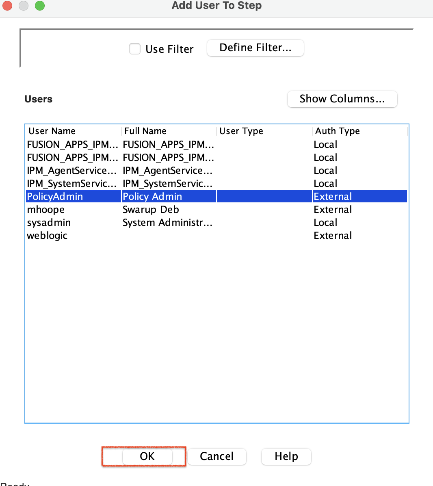
- Click OK.
- Click the Exit Conditions tab.
  - Specify how many reviewers must approve the revision before it passes to the next step.
    - To require approval by all reviewers, select All reviewers.
    - To specify a minimum number of reviewers who must approve the revision, select At least this many reviewers and enter the number.

  - Typically, exit conditions are useful when metadata could be changed by an external process during the workflow step. Use the following instructions if the step requires additional exit conditions to pass to the next step:
    - Select the Use Additional Exit Condition check box.
    - Click Edit.
    - On the Edit Additional Exit Condition page, select a workflow condition or a metadata field from the Field list.
    - Select an operator from the Operator list. Operator is a dependent choice list that shows operators associated with the Field.
    - Select a value from the Value list. Value is a dependent list based on the option chosen as the Field.
    - Click Add to add the conditional statement to the Condition Clause. The clause appears in the Condition Clause box. You can append multiple clauses with AND statements.
    - Repeat for as many conditions as required. To modify an expression, select it in the Condition Clause box, change the Field, Operator, or Value, and click Update.
    - To modify the condition expression, select the Custom Condition Expression check box and edit the script (for example, use OR not AND for a condition). The additional exit conditions must be Idoc Script statements that evaluate to true or false. Do not enclose the code in Idoc Script tags <$ $>.
    - Caution:
      - If Custom Condition Expression is deselected, the expression reverts to its original definition and all modifications are lost.
    - Click OK.

- If the workflow requires conditional steps or special processing, click the Events tab and add the appropriate scripts. For more information, see Creating a Jump.

- Click OK.
  - Add, edit, and delete steps as necessary to complete the workflow.
    - To add another step to the workflow, repeat steps 12 through 23.
    - To edit an existing step, select the step and click Edit.
    - To delete an existing step, select the step and click Delete.
- Ensure that the correct workflow is selected in the left pane, and click Enable.
- On the confirmation page, click Yes to activate the selected workflow.

This Completes this Live Lab.

### Learn More

- [Using Oracle WebCenter Content on Marketplace in Oracle Cloud Infrastructure](https://docs.oracle.com/en/cloud/paas/webcenter-content/webcenter-content-marketplace/index.html#provision-webcenter-content-stack)
- [Introduction To WebCenter Content](https://docs.oracle.com/en/middleware/webcenter/content/12.2.1.4/index.html)

## Acknowledgements

- **Authors-** Janardhana M T, Senior Member Technical Staff, Oracle WebCenter Content
- **Contributors-** Sujata Nayak, Senthilkumar Chinnappa, Mandar Tengse , Parikshit Khisty
- **Last Updated By/Date-** Janardhana M T,April 2025
